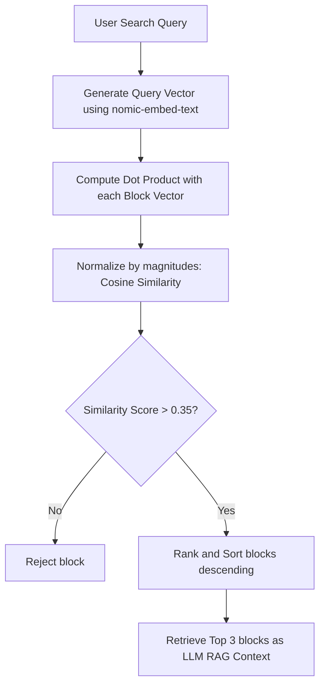

# Post-Stream Ingestion & Analysis Engine

An advanced Express & TypeScript backend designed to ingest post-stream YouTube videos and completed livestreams, scrape their transcripts and live chat records, align comments to transcript segments via typing-latency adjustments, generate local vector embeddings, and support context-guided RAG (Retrieval-Augmented Generation) Q&A queries.


---

## 🚀 Key Features

* **Dual Scrape Ingestion**: Scrapes subtitle transcripts and pulls completed live chat replays using Python sub-processes, falling back dynamically to standard comments if no chat log exists.
* **Typing Latency Synchronization**: Compensates for typical typing speed delay ($1.5 \text{ seconds per word}$) by shifting comment timestamps backward to align them with the exact video event they reference.
* **Cohesive Block Compilation**: Groups compiled voice transcripts and audience chat logs into **2-minute (120-second) chronological timeline blocks**.
* **Local Semantic Search**: Assigns high-dimensional concept vectors to blocks using the local `nomic-embed-text` embedding model.
* **Context-Driven RAG Q&A**: Stream responses token-by-token from a local `gemma3:1b` model using Server-Sent Events (SSE) based on cosine similarity context ranking.
* **Automatic Translation**: Translates non-English transcripts and comments into English.

---

## 🛠️ Project Structure

This project follows the **MVC (Model-View-Controller)** pattern separating route mapping from business logic execution.

```text
backend/
├── src/
│   ├── controllers/      # Handles business logic and request processing
│   │   ├── ai.controller.ts
│   │   ├── archive-chat.controller.ts
│   │   ├── transcript.controller.ts
│   │   └── video.controller.ts
│   ├── routes/           # Registers endpoint URLs and maps to controller functions
│   │   ├── ai.routes.ts
│   │   ├── archive.routes.ts
│   │   ├── transcript.routes.ts
│   │   └── video.routes.ts
│   ├── services/         # Reusable core utility and AI engines
│   │   ├── ai-summarizer.service.ts
│   │   ├── data-processor.service.ts
│   │   ├── embedding.service.ts
│   │   ├── google.service.ts
│   │   ├── local-ai.service.ts
│   │   ├── search.service.ts
│   │   ├── timeline.service.ts
│   │   └── transcript.service.ts
│   ├── utils/            # Helper parsing scripts
│   │   ├── fetch_archive_chat.py
│   │   └── youtube-parser.ts
│   └── index.ts          # Main Express app startup file
└── package.json
```

---

## 📡 API Endpoints

### 1. Video Ingestion Endpoints (`/api/video`)

* **`POST /api/video/detail`**
  * Establishes an SSE stream to extract the video ID and fetch metadata (channel handle, stream type) from the YouTube API.
  * **Request Body**: `{ "url": "https://www.youtube.com/watch?v=..." }`

* **`POST /api/video/analyze`**
  * Establishes an SSE stream to process the full video. Scrapes transcripts/chat, aligns comment timestamps, compiles 2-minute timeline blocks, generates semantic embeddings, and creates a master markdown summary.
  * **Request Body**: `{ "url": "https://www.youtube.com/watch?v=...", "channelLink": "https://youtube.com/@channel" }`

---

### 2. Local AI & Query Endpoints (`/api/ai`)

* **`POST /api/ai/summarize`**
  * Establishes an SSE stream. Automatically partitions the transcript text and streams back bulleted summary notes from the local LLM.
  * **Request Body**: `{ "url": "https://www.youtube.com/watch?v=..." }`

* **`POST /api/ai/query`**
  * Streams an interactive Q&A response from the LLM based on user queries.
  * **Request Body**:
    ```json
    {
      "url": "https://www.youtube.com/watch?v=...",
      "question": "What did the streamer say about the build failure?",
      "timelineBlocks": [ /* List of blocks with pre-computed embeddings */ ]
    }
    ```
  * **Flow**:
    1. If blocks contain `.embedding` arrays, it uses **semantic vector similarity** (Cosine similarity calculation) to find the top 3 blocks.
    2. If no embeddings are found, it falls back to a **keyword density match score**.
    3. The closest 3 blocks are fed to `gemma3:1b` context to stream the answer.

---

### 3. Transcript Processing Endpoints (`/api`)

* **`POST /api/transcript`**
  * Fetches the video subtitle transcript and returns it translated to English.
  * **Request Body**: `{ "url": "https://www.youtube.com/watch?v=..." }`

* **`POST /api/process-outcomes`**
  * Analyzes the video text to generate suggest keywords (tags), auto-chapters based on transition phrases, and processing statistics.
  * **Request Body**: `{ "url": "https://www.youtube.com/watch?v=..." }`

---

### 4. Archive Downloading Endpoints (`/api/archive`)

* **`POST /api/archive/chat-or-comments`**
  * Directly fetches chat records. Checks for active live chat, falls back to completed chat replays, and falls back to standard comment logs.
  * **Request Body**: `{ "url": "https://...", "channelLink": "https://...", "onlyStreamerChat": true }`

---

## ⚙️ In-Memory Semantic Search Flow

The semantic search matches the user's intent mathematically rather than relying on exact string matches:



---

## 🔧 Prerequisites & Setup

### 1. Install local AI models with Ollama
Make sure [Ollama](https://ollama.com/) is installed and running locally:
```bash
# Pull the chat LLM
ollama pull gemma3:1b

# Pull the vector embedding model
ollama pull nomic-embed-text
```

### 2. Configure Environment Variables
Create a `backend/.env` file with your YouTube API and Hugging Face credentials:
```env
PORT=5000
YOUTUBE_API_KEY=YOUR_GOOGLE_DEVELOPER_KEY
HF_API_KEY=YOUR_HUGGING_FACE_TOKEN
```

### 3. Install Dependencies & Start Server
Ensure pnpm is installed:
```bash
cd backend
pnpm install
pnpm run dev
```
The server will start running on `http://localhost:5000`.
